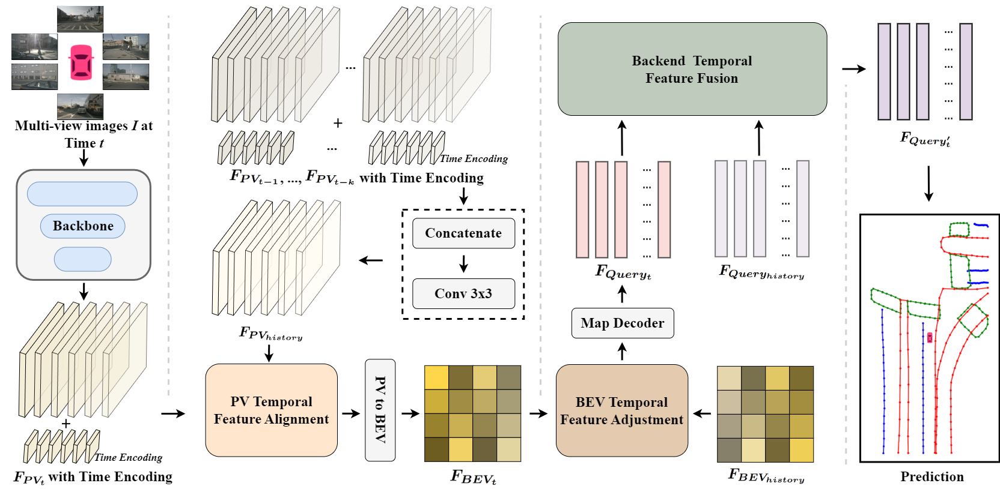
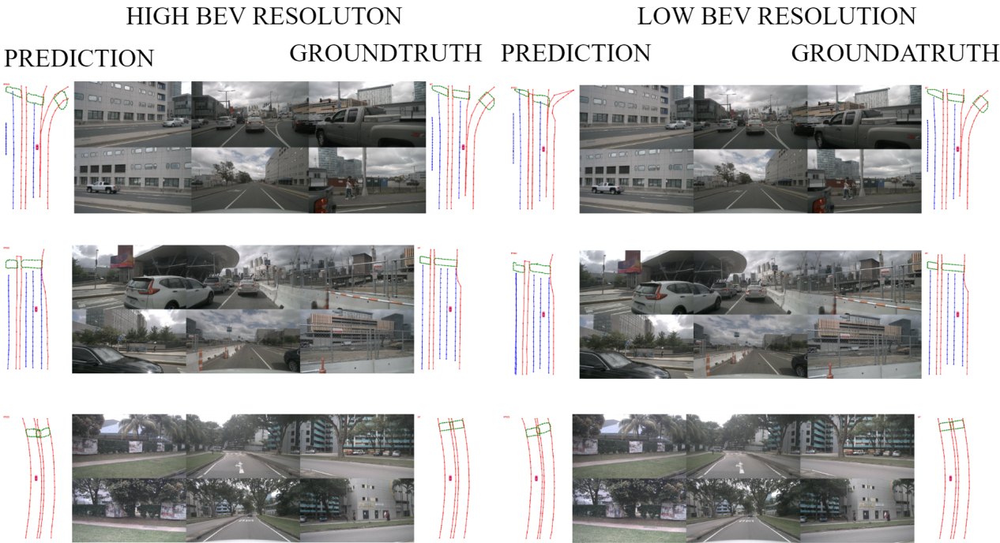
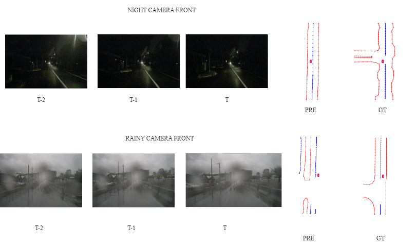

<h1>TICMapNet</h1>
<h3>A Tightly Coupled Temporal Fusion Pipeline for Vectorized HD Map Learning</h3>

## Introduction

<h4>TICMapNet is a simple and general temporal fusion pipeline designed for vectorized HD map construction.</h4>

Wenzhao Qiu1,Shanmin Pang1 :email:,Hao Zhang1,Jianwu Fang1,Jianru Xue1

1 the School of Software Engineering, Xi’an Jiaotong University

(:email:) corresponding author

accepted as **RA-L**

High-Definition (HD) map construction is essential for autonomous driving to accurately understand the surrounding environment. In this paper, we propose a  **Ti**ghtly **C**oupled temporal fusion Map Network (TICMapNet). TICMapNet breaks down the fusion process into three sub-problems: PV feature alignment, BEV feature adjustment, and Query feature fusion. By doing so, we effectively integrate temporal information at different stages through three plug-and-play modules, using the proposed tightly coupled strategy. Our approach does not rely on camera extrinsic parameters, offering a new perspective for addressing the visual fusion challenge in the field of object detection. Experimental results demonstrate that TICMapNet significantly enhances the single-frame baseline and achieves impressive performance across multiple datasets.

## Getting Started
- [Prepare Dataset](prepare_dataset.md)
- [Installization](Install.md)

## Models

<h4> Results on the nuScenes validation dataset</h4>

| Method | Backbone | PV2BEV |BEVDeocder|Lr Schd | mAP| Config | Download |
| :---: | :---: | :---: | :---: |  :---: |:---: | :---:|:---: |
| **ours_2** | R50 |GKT |DQ| 24ep |59.0  |[config](config/fusion/nus_tiofuisondq_r50e24.py) |[model](https://1drv.ms/u/s!AklTOiULSSxpi1vwb6Pm9y1B36qn?e=aaOUMx)|

<h4> Results on the OpenLane 300 validation dataset</h4>

| Method | Backbone | PV2BEV |BEVDeocder|Lr Schd | mAP| Config | Download |
| :---: | :---: | :---: | :---: |  :---: |:---: | :---:|:---: |
| **ours_1** | R50 |GKT |VA| 10ep |61.7  |[config](config/fusion/openlane_tiofusionva_r50e24.py) |[model](https://1drv.ms/u/s!AklTOiULSSxpi1lhtUCz53HILIid?e=FXrNrA)|
| **ours_2** | R50 |GKT |DQ| 10ep |60.6  |[config](config/fusion/openlane_tiofusiondq_r50e24.py) |[model](https://1drv.ms/u/s!AklTOiULSSxpi1pLXNxq2qTj8jN2?e=piUU7h)|

<h4> Results on the new nuScenes validation dataset</h4>

| Method | Backbone | PV2BEV |BEVDeocder|Lr Schd | mAP| Config | Download |
| :---: | :---: | :---: | :---: |  :---: |:---: | :---:|:---: |
| **ours_2[1]** | R50 |GKT |DQ| 24ep |28.3  |[config](config/new_split/nus_maptr_fusion_new_split.py) |[model](https://1drv.ms/u/s!AklTOiULSSxpjAnuSD-wRGktdNQL?e=rzeVSc)|
| **ours_2[2]** | R50 |GKT |DQ| 24ep |32.9  |[config](config/new_split/ticmapnet_newsplit_stream.py) |[model](https://1drv.ms/u/s!AklTOiULSSxpjB5kUNQ6pi6yfR8f?e=vPH8eb)|

<h4> Results of TICMapNet_t on the nuScenes validation dataset</h4>

| Method | Backbone | PV2BEV |BEVDeocder|Lr Schd | mAP| Config | Download |
| :---: | :---: | :---: | :---: |  :---: |:---: | :---:|:---: |
| **ours_2** | R50 |GKT |DQ| 24ep |57.4  |[config](config/saved_memroy/nus_maptr_fusion_save_memory.py) |[model](https://1drv.ms/u/s!AklTOiULSSxpjAihTlZliVZ06L7I?e=AqsAfv)|

<h4> Results of TICMapNet_t on the OpenLane 300 validation dataset</h4>

| Method | Backbone | PV2BEV |BEVDeocder|Lr Schd | mAP| Config | Download |
| :---: | :---: | :---: | :---: |  :---: |:---: | :---:|:---: |
| **ours_2** | R50 |GKT |VA| 10ep |59.7  |[config](config/saved_memroy/openlane_maptr_fusion_savememory.py) |[model](https://1drv.ms/u/s!AklTOiULSSxpjAemTymfm13wfMQb?e=0Bez0s)|

<h4> More Frames Results on the nuScenes validation dataset</h4>

| Historical frames | Backbone | PV2BEV |BEVDeocder|Lr Schd | mAP| Config | Download |
| :---: | :---: | :---: | :---: |  :---: |:---: | :---:|:---: |
| 1 | R50 |GKT |DQ| 24ep |59.0  |[config](config/fusion/tiomapnet_fusion_mutiframe.py) |[model](https://1drv.ms/u/s!AklTOiULSSxpi1vwb6Pm9y1B36qn?e=aaOUMx)|
| 2 | R50 |GKT |DQ| 24ep |60.1  |[config](config/fusion/tiomapnet_fusion_mutiframe.py) |[model](https://1drv.ms/u/s!AklTOiULSSxpjB0V3mAq3p8lzMNG?e=59ogUT)|
| 3 | R50 |GKT |DQ| 24ep |61.3  |[config](config/fusion/tiomapnet_fusion_mutiframe.py) |[model](https://1drv.ms/u/s!AklTOiULSSxpjCH9tBagndcNypB_?e=5NZ6bh)|

**Notes**:

**ours_1** employs [MapTR](https://github.com/hustvl/MapTR) as a single-frame baseline, and **ours_2** introduces [Decoupled Query](https://github.com/hustvl/MapTR) based on **ours_1**.

## Qualitative results on nuScenes validation dataset and OpenLane 300 validation dataset

<h4> TICMapNet maintains stable and robust map construction quality in various driving scenes.</h4>

  

<h4> TICMapNet and TICMapNet_l visualization results on the nuScenes validation dataset.</h4>

<h4> Some failure cases on the new nuScenes validation dataset[2]</h4>

[1]A. Lilja, J. Fu, E. Stenborg, and L. Hammarstrand, "Localization is all you evaluate: Data leakage in online mapping datasets and how to fix it," in CVPR 2024, pp. 22150–22159.

[2]T. Yuan, Y. Liu, Y. Wang, Y. Wang and H. Zhao, "StreamMapNet: Streaming Mapping Network for Vectorized Online HD Map Construction," in WACV 2024, pp. 7341-7350.

## Qualitative results on self-collected dataset

<h4> TICMapNet maintains stable and robust map construction quality compared with the single baseline.</h4>

### *TICMapNet on self-collected dataset*
[**video**](https://1drv.ms/v/c/692c490b253a5349/EabOhqxCabNEhvTZXIwiu9YBtMGiMbIl_OE9_MF5ZBTBhA?e=1dR4XU)

### *MapTR on self-collected dataset*
[**video**](https://1drv.ms/v/c/692c490b253a5349/EdZiRUXUgtpCnoGuVggfP1MBv1cga6hOJaLBAJrrDAq3pg?e=V3WAmQ)

## Acknowledgements

TICMapNet is based on [MapTR](https://github.com/hustvl/MapTR). It is also greatly inspired by the following outstanding contributions to the open-source community:[BEVFormer](https://github.com/fundamentalvision/BEVFormer),  [StreamMapNet](https://github.com/yuantianyuan01/StreamMapNet),[BEVFusion](https://github.com/mit-han-lab/bevfusion),[GKT](https://github.com/hustvl/GKT),[mmdetection3d](https://github.com/open-mmlab/mmdetection3d).
